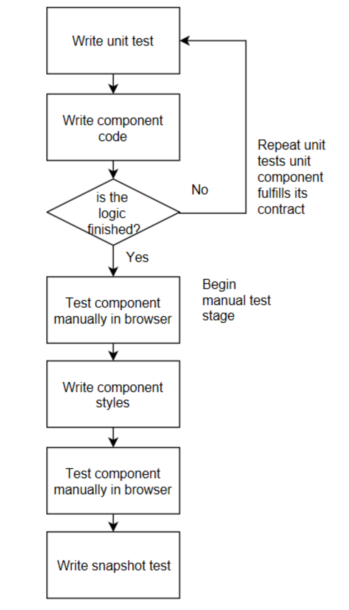

# covered examples:

- unit
  - rendered component output
    - text content
    - dom attributes
    - how many components are rendered
    - classes
    - style
    - component props
    - jsdom limitations
  - mocks
    - timer functions
    - public component methods
    - mock module dependencies
    - async code
  - events
    - native dom events (clicks)
    - custom vue event
      - component emits event
      - component listen for event
  - vue router
  - mixins
    - local
    - global
  - filters
  - forms
    - input forms
    - control inputs
    - radio buttons
  - vuex
    - test as instance
    - or seperatly
      - mutations
      - getters
      - actions
    - vuex in components
  - server side rendering
  - factory
    - component factory
    - store factory
    - wrapper factory
- integration
  - not needed ?
- snapshots
- end 2 end tests
  - for routes
  - for dynamic data
  - multiple browsers

# recomended test flow

# test coverage

enable in `jest.config.js`

# debugging

- run `yarn test:unit:debug`
- open `chrome://inspect` in chrome browser

# dependencies

list of dependencies added after vue project is created with default settings:

- vue cli-plugin-unit-jest -> https://github.com/vuejs/vue-cli/tree/dev/packages/%40vue/cli-plugin-unit-jest
- flush-promises -> https://www.npmjs.com/package/flush-promises
- jest-date-mock -> https://www.npmjs.com/package/jest-date-mock
